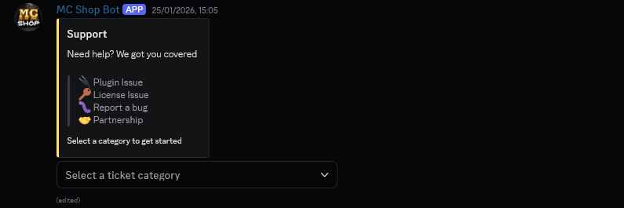
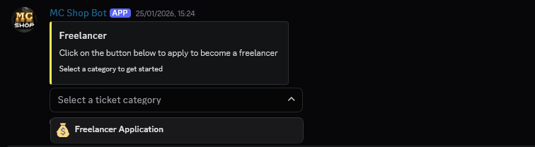
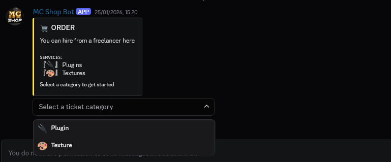
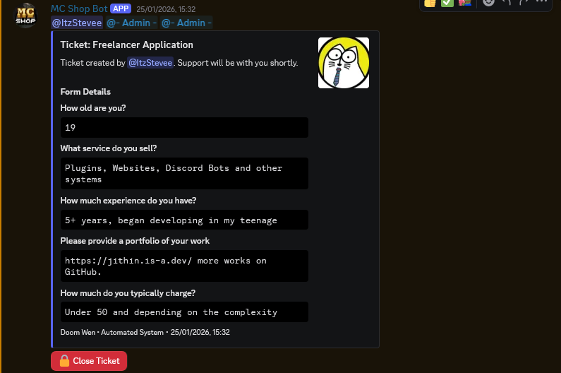
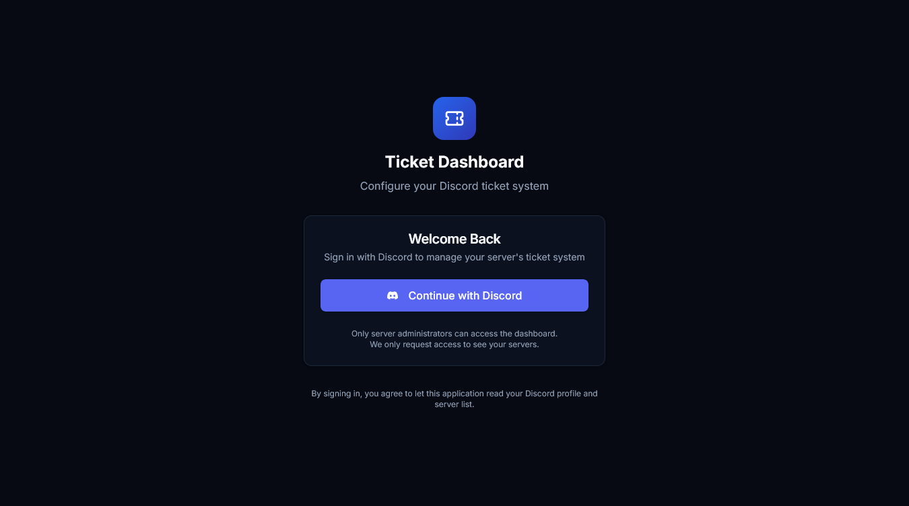
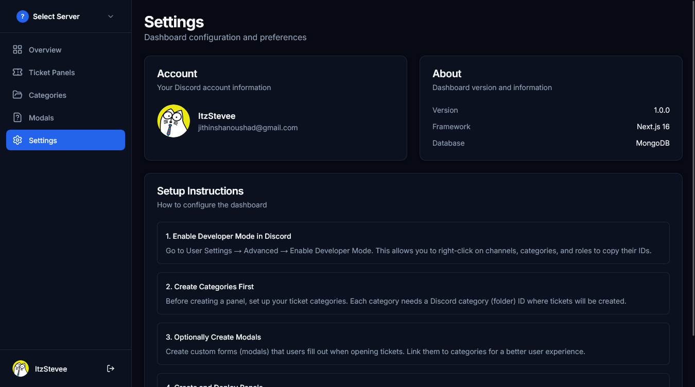
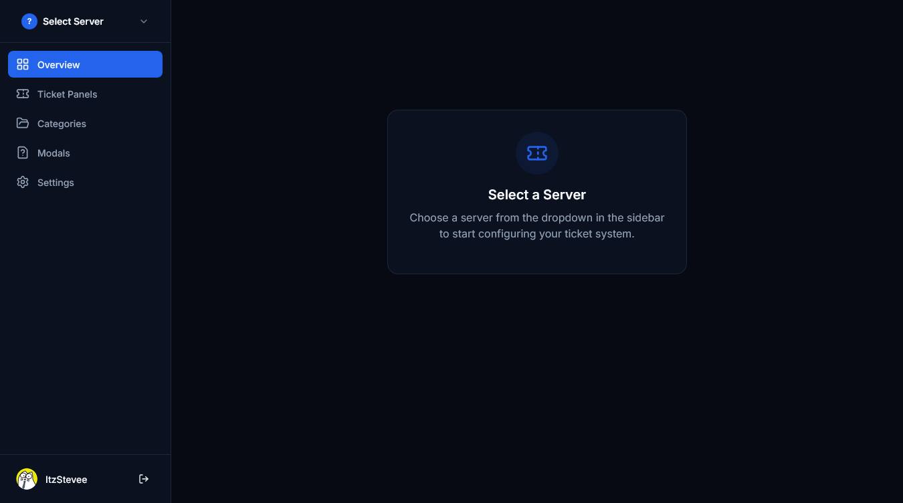

# Doom Wen Discord Bot

A production-ready Discord bot for support operations, commission workflows, and community automation across multiple servers.

## Overview

Doom Wen is built with TypeScript, Discord.js v14, and MongoDB. It combines structured ticket handling, commission lifecycle tracking, moderation tooling, and engagement systems into one bot.

## Core Systems

- **Ticket System** — Configurable ticket panels, category routing, optional intake modals, participant management, and transcript generation.
- **Commission Workflow** — Commission-specific ticket flow with claim/start, quote handling, completion confirmation, and dashboard re-posting.
- **Welcome Automation** — Embed-based welcome messages with placeholders and media support.
- **YouTube Alerts** — Polling-based upload notifications with ping modes (`none`, `@here`, `@everyone`, or role).
- **Counting Game** — Managed counting channel with set/reset/disable controls.
- **Keyword Auto-Replies** — Trigger-response system for recurring questions.
- **Reusable Embeds** — Save, send, and remove server-specific announcement embeds.
- **Reaction Roles** — Role assignment system via emoji interactions.
- **Admin Controls** — Runtime cache reload and dashboard link command.

## Command Reference

### Ticket & Commission

| Command | Purpose |
|---|---|
| `/set-ticket-panel` | Create or update the ticket panel message and button behavior. |
| `/add-category` | Add a ticket category (roles, destination category, commission flag, modal linkage). |
| `/remove-category` | Remove an existing ticket category. |
| `/add-modal` | Create an intake modal (up to 3 configurable questions). |
| `/remove-modal` | Delete a configured modal by ID. |
| `/close-ticket` | Close the current ticket and trigger transcript handling. |
| `/ticket-add-user` | Add a user to the current ticket channel. |
| `/commission-dashboard` | Re-send the commission dashboard in the current commission ticket. |

### Community & Notifications

| Command | Purpose |
|---|---|
| `/configure-welcome` | Enable/disable welcome system and configure embed content. |
| `/set-youtube-channel` | Enable, disable, or inspect YouTube alert configuration. |
| `/set-counting-channel` | Set counting channel, reset count, or disable counting. |
| `/reaction-role` | Manage reaction-role messages and emoji-role mappings. |

### Moderation & Content

| Command | Purpose |
|---|---|
| `/add-keyword-reply` | Add a keyword trigger and automatic response. |
| `/remove-keyword-reply` | Remove a configured keyword trigger. |
| `/create-embed` | Create and save a reusable embed template. |
| `/send-embed` | Send a saved embed to a selected channel. |
| `/remove-embed` | Delete a saved embed template. |

### Administration

| Command | Purpose |
|---|---|
| `/admin reload` | Reload bot configuration caches at runtime. |
| `/dashboard` | Send the Doom Wen dashboard access message. |

## Requirements

- Node.js 18+
- MongoDB instance (local or Atlas)
- Discord Bot application + token
- (Optional) GitHub token/repo for transcript publishing
- (Optional) YouTube API key + channel ID for upload alerts

## Quick Start

```bash
npm install
cp .env.example .env
npm run dev
```

Production:

```bash
npm run build
npm start
```

## Environment Variables

Use `.env.example` as the source of truth. Key groups:

- **Discord:** `DISCORD_TOKEN`, `DISCORD_CLIENT_ID`
- **Database:** `MONGODB_URI`
- **Ownership:** `OWNER_ID`
- **Transcripts:** `GITHUB_TOKEN`, `GITHUB_REPO`, `GITHUB_BRANCH`, `TRANSCRIPT_BASE_URL`
- **BuiltByBit:** `BUILTBYBIT_PROFILE_ID`, `BUILTBYBIT_API_KEY`
- **YouTube:** `YOUTUBE_CHANNEL_ID`, `YOUTUBE_API_KEY`

## Project Structure

```text
src/
├── commands/       # Slash command modules
├── events/         # Discord event listeners
├── interactions/   # Button/select/modal handlers
├── services/       # Background/business services
├── state/          # Ticket/commission state handling
├── utils/          # Shared utility logic
└── index.ts        # App bootstrap
```

## Showcase

> Screenshots from `bot-assets/`.

### 1) Dashboard & Configuration




### 2) Ticket & Commission Flow




### 3) Moderation & Utility Features





## License

ISC
